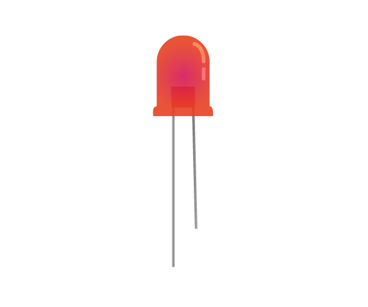

# Biblioteca LED Arduino C++



Essa biblioteca é feita para facilitar o controle não bloqueante de um **LED**.
Permite ligar, desligar, ligar por um tempo, piscar continuamente e piscar por quantidade definida.
Inclui diversas funções nomeadas intuitivamente e explicadas em notas dentro de *LED.h*, para manipular o **LED** de diveras formas e em tempos customizados sem uso de delay, em *Arduino C++*. 
Biblioteca desenvolvida por **Gabriel Expindola** no curso *Desenvolvimento de Sistemas* do **SENAI**.


# Estrutura da Biblioteca
```text
Biblioteca LED/
├── library.json
├── README.md
├── LICENSE
├── src/
│   ├── LED.cpp
│   └── LED.h
└── examples/
